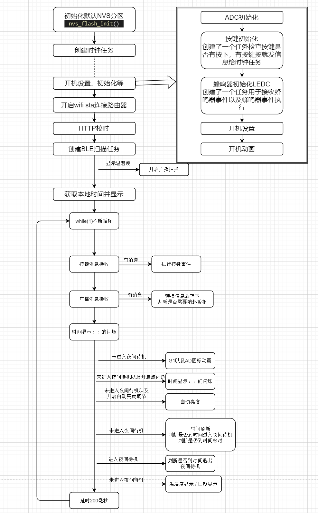

# VFD-CLOCK

简介：以使用ESP32-C3主控，VFD屏幕的桌面VFD时钟

## 描述

### 项目说明

此项目是以FUTABA的VFD屏(13-ST-GINK) + ESP32-C3为主控制作的桌面时钟，通过2.4G WIFI联网获取互联网时间、本地温湿度显示。

时钟使用5V供电，最大亮度下平均工作电流为280mA左右，蜂鸣器响的瞬时电流有700mA，建议使用5V1A或者输出电流更强的适配器供电

夜间待机关闭显示下平均电流84mA左右

### 项目相关功能

1. WIFI联网 HTTP获取互联网时间并显示

2. AHT10温湿度传感器获取温湿度
3. 使用DS3231 RTC，断电后能够恢复系统时间
4. OTA更新固件
5. Web配网

6. 自动亮度调节

7. 温度、湿度异常报警

8. 夜间显示关闭

### 项目进度

- 

### 设计原理

**ESP32-C3模组使用**

模组的程序下载使用C3内置的CDC串口，按键1既做启动时进入Boot模式也做普通按键。

**按键**

  按键1：亮度设置，8档固定亮度以及自动亮度调节(自动亮度启用时小电视图标点亮)，冷启动时进入Boot模式。

  按键2：夜间待机  开/关(开启时点亮 开关标)。

  按键3：显示温湿度/日期  的显示切换。

## **软件说明**

程序使用PlatformIO开发

- configuration.h头文件里可以修改校时时间、夜间关显示待机时间以及退出时间。
- VFD屏通信使用了IO模拟SPI，大概400K的速度。时间的滚动刷新使用了屏内置驱动IC 6个CGRAM来实现，屏的1G动画使用了一个CGRAM，12个5*7点阵上方的为图标为AD寄存器控制，详情请翻阅屏的数据手册以及源码。    
- 时间校准来自于淘宝的服务器，使用了HTTP请求，走时使用了ESP32-C3内部RTC。(B站粉丝数、天气也使用HTTP请求获取)
- 温湿度来自于AHT10，ESP32-C3通过IIC获取温湿度数据。
- 蜂鸣器使用了LEDC产生PWM驱动。
- 按键驱动使用了OneButton库，有按键按下后会给时钟任务发送按键消息。按键1：亮度设置；按键2：夜间待机开关；按键3：显示  温湿度/日期 切换。
- ADC采集环境光传感器分压处的电压，经过转换后为80-240级的亮度调节。
- 温湿度异常报警，独立的温湿度计需要修改程序，在检测到温湿度数据异常时从5秒广播一次改为100毫秒广播一次使时钟能快速获取到异常情况。
- 时钟任务为一个freertos任务，死循环不断重复执行。

程序执行流程：

## 注意事项

1. 使用2.4G WiFi的路由器才能供ESP32-C3连接